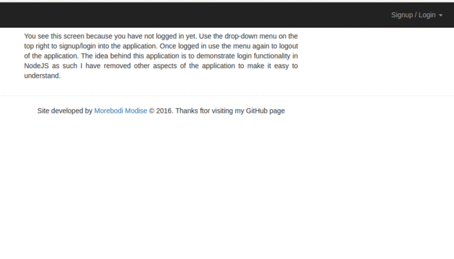

# login-menu-nodejs
A demo app illustrating login feature using nodejs and mongodb

#Demo

#Environment Set-up
<ul>
  <li>You must have NodeJS and mongodb installed in your computer  (alternatively you can use mlab.com)</li>
</ul>

#Instructions
<ul>
  <li>Download the zip file and extract it to your preffered location </li>
  <li>Open the extracted folder in your favorite Text Editor, the code has been well commented</li>
</ul>

<blockquote>
  cd login-menu-nodejs 
  npm install
</blockquote>

<ul>
  <li>Once all dependencies are installed, run <b>node server</b></li>
  <li>You should run the above command while you're within the project's root directory</li>
</ul>

